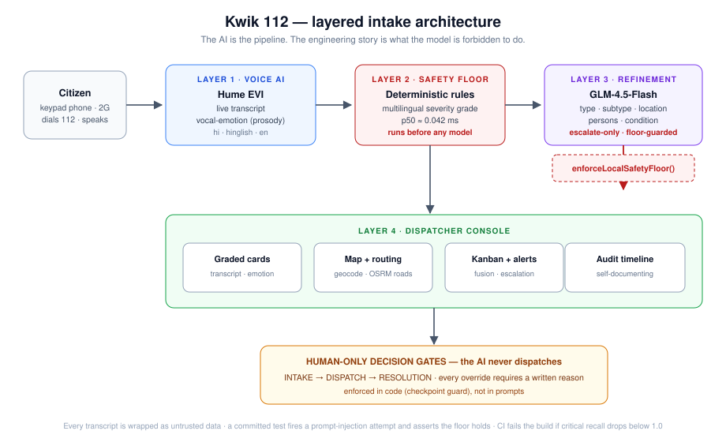
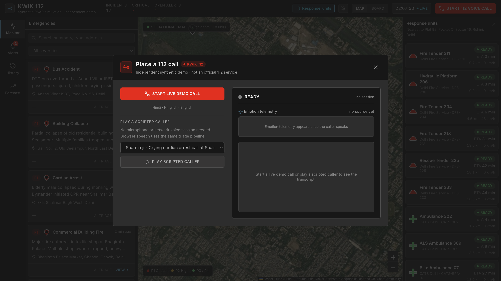
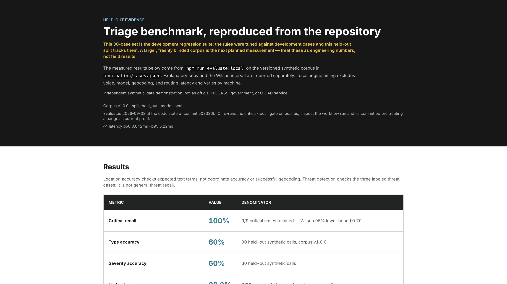
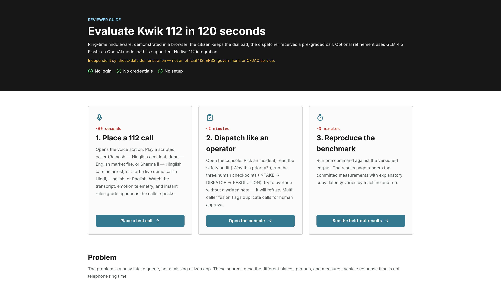
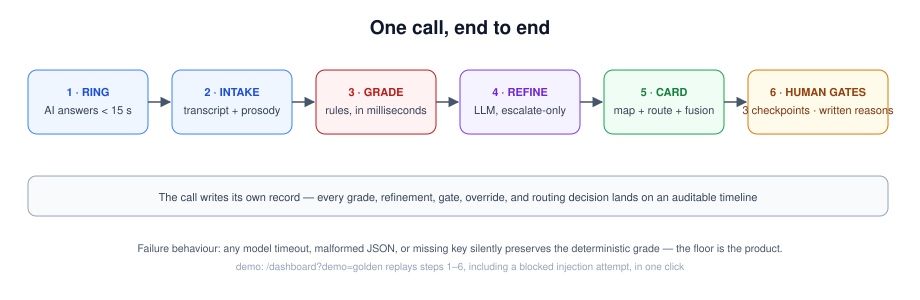

<div align="center">

# KWIK 112

**AI middleware for India's 112 emergency line — the AI is the pipeline, and the engineering story is what the model is forbidden to do.**

[](https://github.com/areycruzer/kwik112-hyperbloom/actions)
[](.github/workflows/ci.yml)
[](LICENSE)
[](https://nextjs.org)
[](https://react.dev)
[](#ai-tooling-and-providers-disclosed)

[Live demo](https://kwik112-hyperbloom.vercel.app) · [Place a test call](https://kwik112-hyperbloom.vercel.app/dashboard?startCall=1#voice-station) · [Judge guide](https://kwik112-hyperbloom.vercel.app/for-judges) · [Benchmark](https://kwik112-hyperbloom.vercel.app/benchmark) · [Video transcript](https://kwik112-hyperbloom.vercel.app/transcript) · [Demo video](https://youtu.be/JdzAXL08_24)

**Provenance:** existing open-source project by the same team (public history); this entry adds the AI/ML architecture write-up.

</div>

---

> Every Indian already knows how to use it: dial 112. Kwik 112 demonstrates a multilingual AI call-taker for that call and the dispatch console behind it — in a browser, with no live telephone integration. The AI may only escalate severity; a human makes every dispatch decision.

A citizen on a keypad phone, on 2G, who cannot read an app, dials 112 — and waits. **Kwik 112 occupies the wait.** A voice AI answers in seconds in Hindi, Hinglish, or English; transcribes the call live; measures vocal distress; extracts location and urgency; and grades the call so a human dispatcher receives structure instead of silence. Three human-only checkpoints gate every decision, and every override requires a written reason.

<p align="center">
  
</p>

## Screenshots

| Voice station — the call | Dispatcher console — the board |
|:---:|:---:|
|  |  |

| Benchmark — failures included | Judge guide — what is real |
|:---:|:---:|
|  |  |

## Why this exists

Reported figures put genuine emergencies at roughly **0.28% of about 16 lakh daily calls** on Telangana's combined 112/Dial 100 line; Delhi reported about **10,000 blank calls a day**; the MHA answer-speed target is **under 15 seconds**. When a call is finally picked up, the dispatcher starts from zero — no transcript, no location, no urgency, no way to tell a heart attack from a pocket dial. The Supreme Court's 2026 order merging every national helpline into 112 puts six services' load on one queue. Sources and caveats (vehicle response time is not telephone ring time) are on the [judge guide](https://kwik112-hyperbloom.vercel.app/for-judges). The multilingual context is grounded in India's official [2011 Census language tables](https://www.censusindia.gov.in/nada/index.php/catalog/42458).

## AI/ML at the center

The AI is not a feature on top of a dashboard — it is the pipeline, and the engineering story is what the AI is *forbidden* to do.

- **Layer 1 — Voice.** Hume EVI runs the conversation, transcribes each turn, and returns per-utterance prosody. A calm voice reporting a robbery and a trembling voice reporting chest pain are different signals; a tested ceiling (`severityBandCeiling`) stops prosody crossing a severity band on its own.
- **Layer 2 — The floor.** Deterministic multilingual rules grade the transcript in milliseconds (p50 ≈ 0.042 ms), before any model responds — because a model that is slow, absent, or wrong must not stand between a caller and an ambulance.
- **Layer 3 — Refinement.** GLM-4.5-Flash (OpenAI-compatible path) restructures the incident — type, subtype, location, persons, condition — under one hard rule enforced in application code, not in a prompt: **it may escalate severity, never lower it.**
- **Layer 4 — Humans.** Three checkpoints gate every status change; overrides require a written note; the AI never dispatches. Duplicate-call fusion is a deterministic AND gate (same type, ≤ 750 m, ≤ 10 min, a shared specific term) that proposes merges for human approval.

<p align="center">
  
</p>

That floor is the mechanism that makes a generative model safe to place on an emergency line at all — its worst case is bounded by construction, covered by regression and prompt-injection tests, and gated in CI. A randomized trial found machine-learning support did not significantly improve dispatcher recognition in its primary comparison ([Blomberg et al., 2021](https://pubmed.ncbi.nlm.nih.gov/33404620/)); Kwik 112 therefore exposes evidence to the operator rather than replacing the operator. The operator checkpoints align with the human-oversight principle in [EU AI Act Article 14](https://eur-lex.europa.eu/eli/reg/2024/1689/2026-07-27/eng).

## One call, end to end

<p align="center">
  
</p>

One scripted caller can traverse voice intake, instant local grading, asynchronous refinement, and the dispatcher board **without provider credentials**: open the [call station](https://kwik112-hyperbloom.vercel.app/dashboard?startCall=1#voice-station), choose Ramesh, Sharma ji, or John (labeled SIMULATED), and play. A live Hume EVI session is optional. [`?demo=golden`](https://kwik112-hyperbloom.vercel.app/dashboard?demo=golden) replays the whole journey — intake, grading, **a blocked injection attempt**, human dispatch — in one click. Pre-arrival guidance follows the safety posture of the [2024 AHA/Red Cross first-aid guidelines](https://www.ahajournals.org/doi/epdf/10.1161/CIR.0000000000001281); dispatcher-assisted CPR has been associated with improved survival versus no bystander CPR in a large cohort ([Rea et al., 2001](https://pubmed.ncbi.nlm.nih.gov/11714643/)).

## Benchmarks — the failures are on the same page

| Held-out local benchmark (development regression suite) | Result |
| --- | ---: |
| Critical recall | **100% (9/9)**; Wilson 95% lower bound 0.70 |
| Incident type / severity accuracy | 60% (18/30) / 60% (18/30) |
| Under-triage / over-triage | 23.3% (7/30) / 16.7% (5/30) |
| Location / threat accuracy | 100% (25/25) / 100% (3/3) |
| Local latency | p50 ~0.042 ms / p95 ~5.219 ms |
| **Same 30 calls, + GLM refinement** | critical recall **9/9 held** · type **93.3%** · severity **76.7%** · under-triage **3.3%** · 2/30 model fallbacks |

Those middling numbers ship in the same type size as the good one, because a triage system that hides its under-triage rate is the failure mode. With the refinement model in the loop, under-triage falls from 23.3% to 3.3% while critical recall holds at 9/9 — the AI's contribution is measured, not asserted, and two model timeouts fell back to the local grade exactly as designed. Context: published US field-triage guidance targets under-triage ≤ 5% while accepting 25–35% over-triage ([Newgard et al., 2022](https://pubmed.ncbi.nlm.nih.gov/35475939/)); observed ranges vary widely ([Lupton et al., 2022](https://pubmed.ncbi.nlm.nih.gov/35191799/)) — context, not a baseline for this synthetic corpus. Fusion: 40 cases, 20 TP / 20 TN / 0 FP / 0 FN. See [`/benchmark`](https://kwik112-hyperbloom.vercel.app/benchmark).

## What is real, and what is not

| Boundary | Current state |
| --- | --- |
| Live voice sessions (Hume EVI) | Real, optional; scripted speech labeled SIMULATED |
| Incidents, units, ETAs | Synthetic; no real caller PII |
| Triage rules, floor, checkpoints, fusion | Real code, fully tested |
| Audit trail | Session-local (localStorage); not a production record store |
| State | Browser-local demo state; no production database or authentication |
| Model refinement | GLM 4.5 Flash free-tier primary; `LLM_PROVIDER=auto\|glm\|openai`; OpenAI path supported |
| Failure mode | Missing keys, timeout, or malformed output preserves the local grade |
| Telephone network | **Not integrated — this is a browser demonstration** |

Kwik 112 is not affiliated with ERSS, 112, the Government of India, or C-DAC, and says so on every page.

## Run it locally

```bash
git clone https://github.com/areycruzer/kwik112-hyperbloom
cd kwik112-hyperbloom
npm install
cp .env.example .env      # optional: the scripted demo needs no keys
npm run dev               # http://localhost:3000
```

Reproduce every published number:

```bash
npm test                  # 256 tests
npm run evaluate:local    # held-out benchmark
npm run evaluate:fusion   # fusion gate metrics
npm run check:raw-html    # narration/VTT alignment
```

Fresh outputs land in `evaluation/results/` with benchmark version, split, mode, provider, source commit, runtime, case-level predictions, and latency distribution. Benchmark contamination remains a known evaluation risk in language-model work ([Golchin and Surdeanu, TACL 2025](https://aclanthology.org/2025.tacl-1.37/)).

## Optional recorded walkthrough

[Watch the demo video](https://youtu.be/JdzAXL08_24) (no video is required at this event), with the [recording script as a page on this site](https://kwik112-hyperbloom.vercel.app/transcript), the [script](docs/kwik-112-round2-video.md), and [WebVTT captions](public/kwik-112-round2.vtt).

## AI tooling and providers, disclosed

Development was AI-assisted — Claude (Claude Code / Opus 5, co-author on 50 commits in the public history), OpenAI Codex, and Cursor — with the dated, commit-linked log committed as [CODEX_LOG.md](CODEX_LOG.md). Runtime AI: GLM-4.5-Flash (refinement, free tier, disclosed) and Hume EVI (voice + prosody). The code uses the OpenAI SDK as a provider-neutral client; model output passes application-side shape validation, an untrusted-transcript boundary, and the deterministic no-downgrade floor. The committed benchmark is local rules-only (`provider: none`) and is not presented as a model result.

## License

[MIT](LICENSE)
